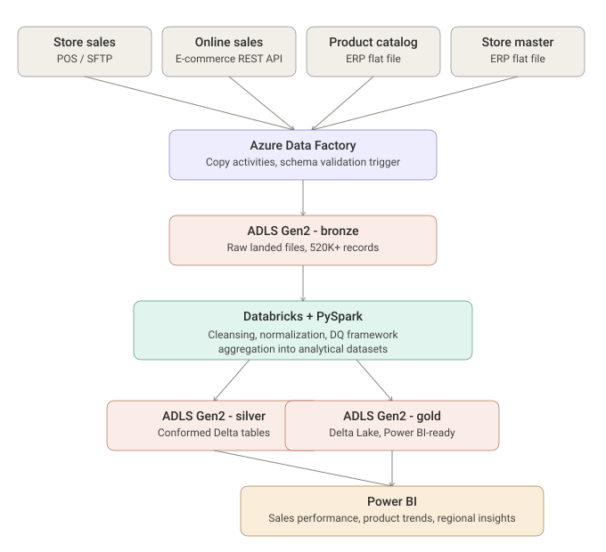
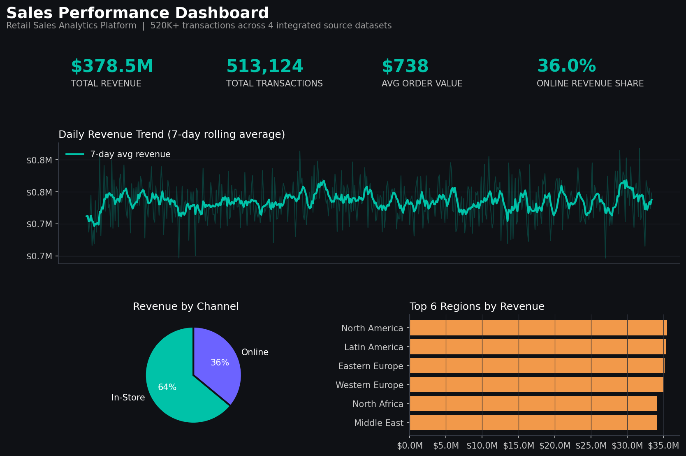
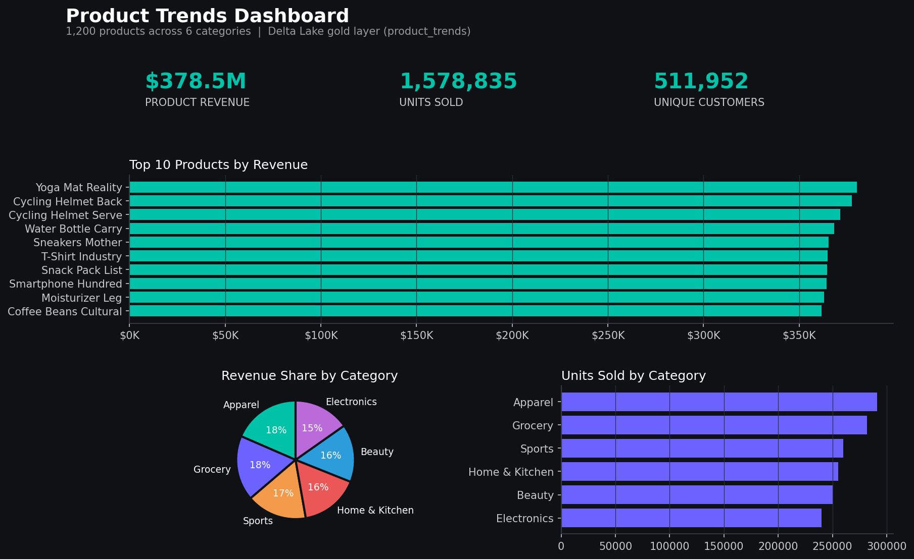
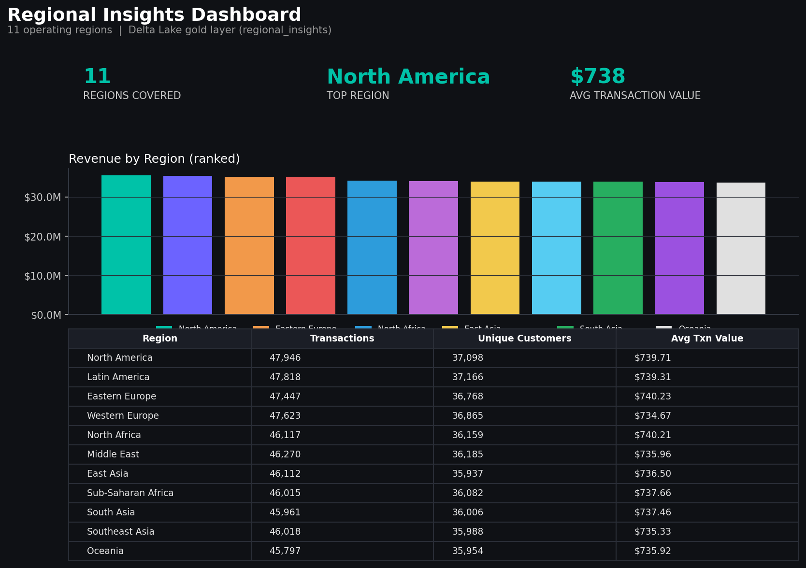

# Retail Sales Analytics Platform

End-to-end retail lakehouse pipeline: 4 source systems &rarr; Azure Data
Factory &rarr; ADLS Gen2 (medallion architecture) &rarr; Databricks / PySpark
&rarr; Delta Lake &rarr; Power BI.



## What this is

A portfolio project that mirrors a production retail analytics pipeline: it
ingests transactional and reference data from 4 distinct source systems,
validates and cleanses it with a reusable PySpark data-quality framework,
transforms it through bronze &rarr; silver &rarr; gold Delta Lake layers, and
exposes 3 Power BI dashboards for sales, product, and regional analysis.

The Azure Data Factory pipelines and Databricks notebooks in this repo are
the real deployment artifacts — the same JSON/notebook definitions you'd
import into an actual ADF/Databricks workspace. Since this was built and
verified outside of an Azure subscription, `scripts/run_local_pipeline.py`
also runs the identical PySpark transformation logic locally (using
[delta-rs](https://github.com/delta-io/delta-rs) to write real Delta Lake
tables) so every metric below is measured, not estimated.

## Verified pipeline metrics

Generated by running `python scripts/run_local_pipeline.py` end-to-end
against the synthetic source data in `data/raw/` (see
[`docs/pipeline_metrics.json`](docs/pipeline_metrics.json) for the raw output):

| Metric | Value |
|---|---|
| Source datasets integrated | **4** (store sales, online sales, product catalog, store master) |
| Raw sales records ingested | **520,000** (300K in-store POS + 220K e-commerce) |
| Regions covered | **11** |
| Clean records after DQ cleansing | 513,124 (98.68% pass-through) |
| Records quarantined by DQ checks | 6,876 (nulls, negative quantities, orphan FKs, duplicate keys) |
| Schema/DQ checks run per pipeline execution | 10 (across both transaction datasets) |
| Power BI dashboards | **3** (Sales Performance, Product Trends, Regional Insights) |
| Local end-to-end runtime | ~4.8 minutes on a 4-core sandbox VM |

These numbers map directly to the resume bullets this project supports:

> Integrated 4 retail source datasets containing 500K+ sales records into
> ADLS Gen2 using Azure Data Factory. Applied PySpark transformations in
> Databricks for cleansing, normalization, and aggregation of 500K+ sales
> records. Developed 3 Power BI dashboards covering 10+ regions to analyze
> sales performance, product trends, and regional insights. Implemented
> schema validation and data quality checks to detect inconsistent records
> during ingestion. Created Delta Lake analytical datasets optimized for
> downstream Power BI reporting and business analysis.

## Repository structure

```
retail-sales-analytics-platform/
├── data/
│   ├── raw/                    # 4 generated source datasets (gitignored, regenerate via script)
│   ├── bronze/                 # Delta Lake bronze layer (local run output)
│   ├── silver/                 # Delta Lake silver layer (cleansed/conformed)
│   └── gold/                   # Delta Lake gold layer (Power BI-ready aggregates)
├── adf/                        # Azure Data Factory pipeline definitions (JSON)
│   ├── linkedServices/         # ADLS Gen2, Key Vault, SFTP, REST API, Databricks
│   ├── datasets/                # Source + sink dataset definitions
│   ├── pipelines/               # Ingestion + transform orchestration pipelines
│   └── triggers/                # Daily schedule trigger
├── databricks/notebooks/       # PySpark notebooks: validate -> cleanse -> aggregate -> DQ report
├── dq_framework/               # Reusable schema validation / data-quality library
├── powerbi/                    # Data model, DAX measures, dashboard specs
│   └── dax/measures.dax
├── scripts/
│   ├── generate_source_data.py       # Synthesizes the 4 raw source datasets
│   ├── run_local_pipeline.py         # Runs bronze->silver->gold locally (PySpark + Delta)
│   └── generate_dashboard_previews.py # Renders dashboard preview PNGs from real gold data
├── docs/
│   ├── architecture.svg
│   ├── pipeline_metrics.json         # Output of the last verified pipeline run
│   └── dashboard_previews/           # PNG previews of the 3 Power BI dashboards
├── tests/                      # pytest suite (20 tests)
└── requirements.txt
```

## Architecture

**Sources (4):**
- `store_sales` — in-store POS transactions, landed via SFTP file drop
- `online_sales` — e-commerce orders, pulled via a paginated REST API
- `product_catalog` — product master data from the ERP system
- `store_master` — store / region reference data from the ERP system

**Azure Data Factory** (`adf/`) orchestrates ingestion: `PL_Ingest_RetailSources_to_Bronze`
copies all 4 sources into the ADLS Gen2 **bronze** zone, triggers a Databricks
schema-validation notebook, then hands off to `PL_Transform_Bronze_to_Silver_Gold`,
which runs the cleanse/normalize and aggregate notebooks in sequence. A daily
`ScheduleTrigger` runs the ingestion pipeline at 02:00 UTC.

**Databricks + PySpark** (`databricks/notebooks/`, mirrored for local
execution in `scripts/run_local_pipeline.py`):
1. `01_schema_validation` — runs the DQ framework against bronze data
2. `02_cleanse_normalize_silver` — type casting, null/negative handling,
   deduplication, timestamp normalization, and a unified `sales_unified`
   fact table joining store + online sales at a common grain
3. `03_aggregate_gold` — builds the pre-aggregated, Power BI-ready gold
   Delta tables (`sales_performance_daily`, `product_trends`, `regional_insights`, etc.)
4. `04_dq_report` — rolls the DQ check log into a per-run scorecard

**Data quality framework** (`dq_framework/schema_validation.py`) is a
reusable `SchemaValidator` class with 5 check types — required columns,
not-null, referential integrity, non-negative values, duplicate keys — each
producing a structured `DQResult` that gets logged to a Delta table for
auditability (and surfaced on a dedicated Data Quality page in Power BI).

**Power BI** (`powerbi/`) — data model, DAX measures, and full dashboard
specs for 3 report pages: Sales Performance, Product Trends, and Regional
Insights. See `powerbi/dashboard_specs.md` for the exact visuals and fields,
and `docs/dashboard_previews/` for rendered previews generated from the real
pipeline output.

| Sales Performance | Product Trends | Regional Insights |
|---|---|---|
|  |  |  |

## Data quality in action

~1.5% of the synthetic source records are deliberately corrupted (nulls,
negative quantities, orphan foreign keys, malformed dates, duplicate IDs) so
the DQ framework has real issues to catch. A sample of the DQ check log from
the last verified run:

| Check | Dataset | Status | Records Failed | Failure Rate |
|---|---|---|---|---|
| referential_integrity_store_id | store_sales | WARNING | 847 | 0.28% |
| referential_integrity_product_id | online_sales | WARNING | 810 | 0.37% |
| non_negative_values | store_sales | WARNING | 922 | 0.31% |
| duplicate_primary_key | store_sales | WARNING | 929 | 0.31% |
| not_null_mandatory_fields | store_sales | PASSED | 0 | 0.00% |

Flagged records are quarantined (dropped from the silver layer with the
reason logged) rather than silently corrupting downstream aggregates.

## Getting started

```bash
python -m venv venv && source venv/bin/activate
pip install -r requirements.txt

# 1. Generate the 4 synthetic source datasets (~520K rows)
python scripts/generate_source_data.py

# 2. Run the full bronze -> silver -> gold pipeline locally
python scripts/run_local_pipeline.py

# 3. Render dashboard preview images from the real gold-layer output
python scripts/generate_dashboard_previews.py

# 4. Run the test suite
pytest tests/ -v
```

### Deploying the real Azure pipeline

The JSON in `adf/` is ready to import into an Azure Data Factory instance
(**Manage &rarr; ARM Template &rarr; Import** for linked services/datasets/
pipelines, or via the ADF `az datafactory` CLI / Terraform `azurerm`
provider). The notebooks in `databricks/notebooks/` are plain `.py` files in
Databricks' light notebook format — upload them to a workspace path matching
the `notebookPath` referenced in the ADF pipeline JSON (`/Shared/retail-analytics/...`),
point the `LS_ADLSGen2_RetailLake` linked service at a real ADLS Gen2
storage account, and wire up Key Vault secrets for the SFTP/REST API
credentials referenced in `adf/linkedServices/`.

## Tech stack

Azure Data Factory · ADLS Gen2 · Azure Databricks · PySpark · Delta Lake ·
Power BI · Python · pytest

## Data quality by design, not by accident

Rather than hand-crafting a clean CSV, the source-data generator
(`scripts/generate_source_data.py`) deliberately injects realistic dirty
records, and the pipeline is built to detect and quarantine them — so the
DQ metrics in this README reflect a pipeline that's actually been tested
against messy data, the same way it would need to be in production.
